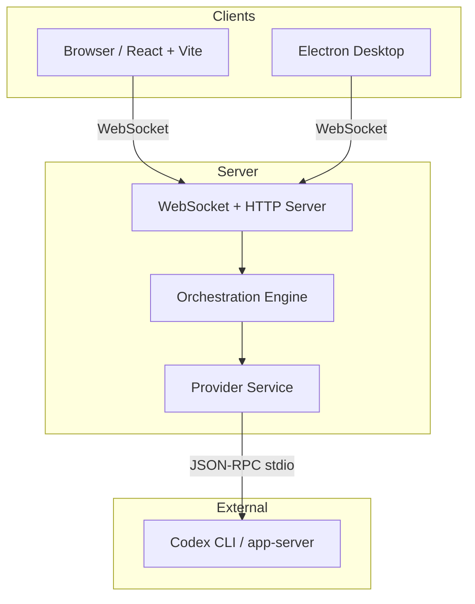
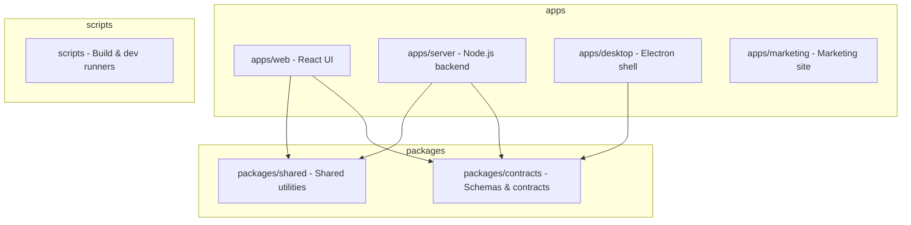
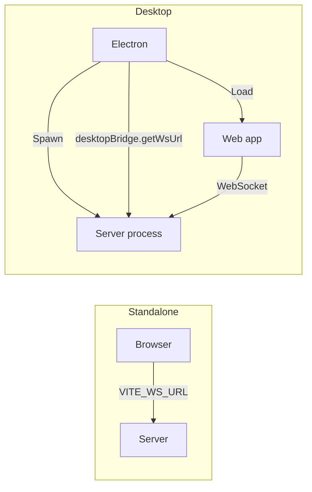
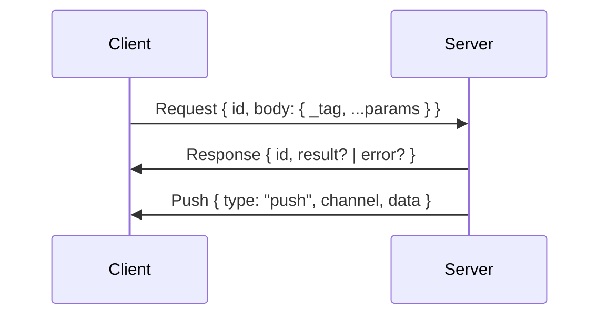
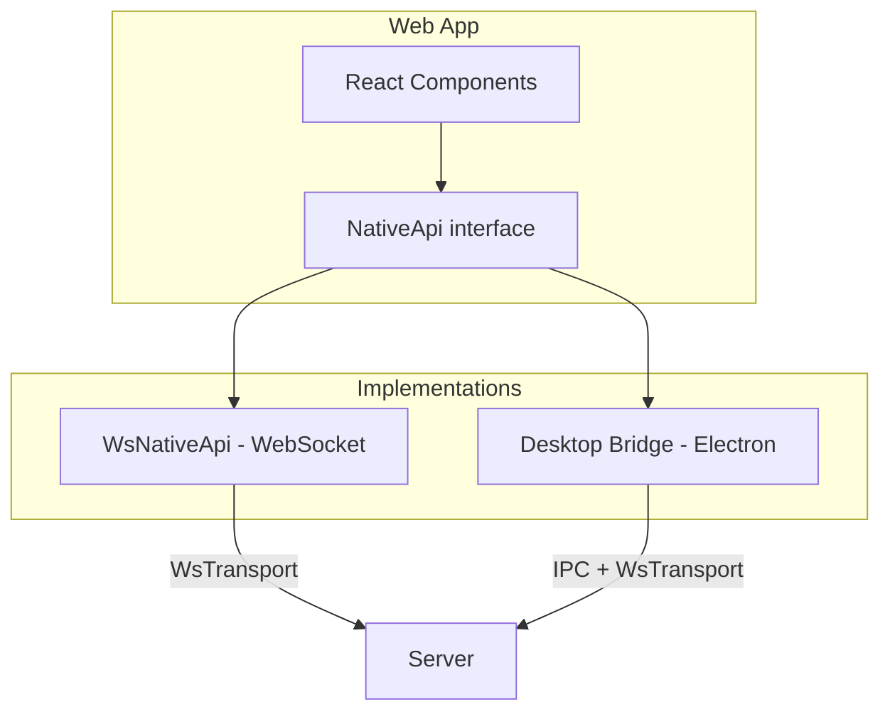
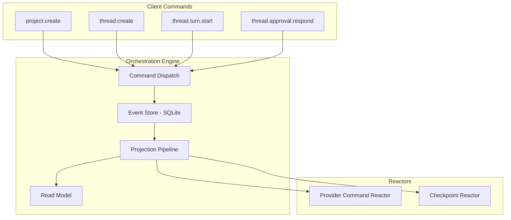
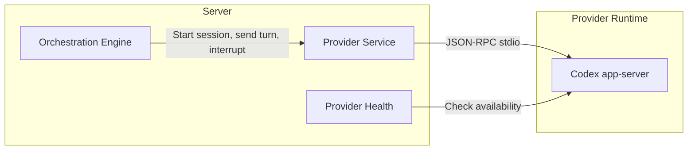
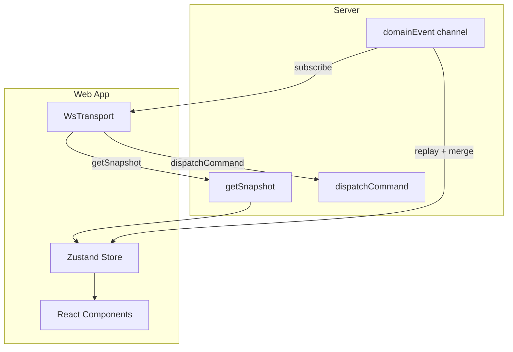
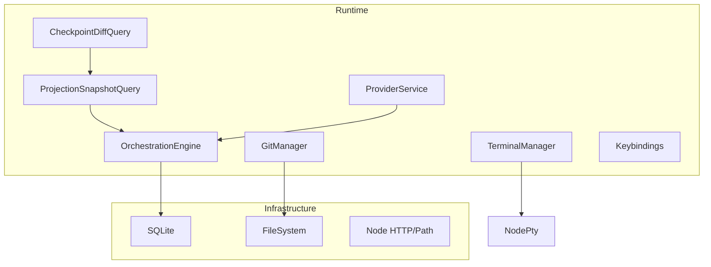
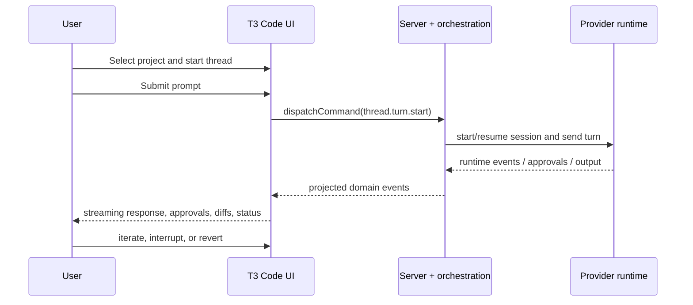

# Architecture

This document describes the architecture of the application for use by AI coding assistants and external tooling. It uses Mermaid diagrams for visual reference.

Read this alongside:

- `README.md` for setup, usage, and the repo-level overview
- `AGENTS.md` for implementation constraints and AI-agent-specific guidance

---

## Overview

The application is a **minimal web GUI for coding agents**. It runs as a Node.js WebSocket server that orchestrates AI coding providers (Codex-first) and serves a React web app. The system supports both browser-based and Electron desktop deployments.



---

## Monorepo Structure

The codebase is a **Turborepo monorepo** with npm workspaces. Build order is managed by Turbo; the contracts package must build before dev tasks.



| Path | Purpose |
|------|---------|
| `apps/web` | React + Vite SPA. TanStack Router, React Query, Zustand. Session control, chat UI, diff rendering. |
| `apps/server` | Node.js (Bun) server. HTTP + WebSocket, static asset serving, orchestration, provider management, Git, terminal. |
| `apps/desktop` | Electron shell. Spawns backend process, loads web app, exposes native bridge (dialogs, context menu, updates). |
| `packages/contracts` | Effect Schema types for WebSocket protocol, orchestration commands/events, provider, terminal, Git, project. |
| `packages/shared` | Model resolution, Git helpers, shell, logging, Net utilities. |

---

## Deployment Modes



- **Standalone**: `npx t3` starts the server, opens browser. Web app connects via `VITE_WS_URL` or same host.
- **Desktop**: Electron spawns a desktop-scoped server, loads the built web app, and bridges native APIs (folder picker, context menu, updates).

---

## Communication Layer

### WebSocket Protocol

All client–server communication uses a **JSON WebSocket RPC** protocol defined in `packages/contracts/src/ws.ts`.



- **Request/Response**: Tagged union body (`_tag` = method name). Methods include orchestration, Git, terminal, projects, server config.
- **Push**: Server broadcasts events on channels (e.g. `orchestration.domainEvent`, `terminal.event`, `server.welcome`).

### Native API Abstraction

The web app uses a `NativeApi` interface that can be satisfied by:

1. **WebSocket transport** (`wsNativeApi.ts`): Used when no `window.nativeApi` or `window.desktopBridge` exists. All methods map to WebSocket RPC.
2. **Desktop bridge**: When running in Electron, `window.desktopBridge` provides native dialogs, context menu, updates; other calls still go over WebSocket.



---

## Orchestration & Event Sourcing

The server uses an **event-sourced orchestration engine** for projects, threads, and provider sessions.



### Aggregates

- **Project**: Workspace root, title, scripts, default model.
- **Thread**: Belongs to a project; has messages, turns, checkpoints, session, activities, proposed plans.

### Commands (Client-Dispatchable)

| Command | Purpose |
|---------|---------|
| `project.create`, `project.meta.update`, `project.delete` | Project CRUD |
| `thread.create`, `thread.delete`, `thread.meta.update` | Thread CRUD |
| `thread.runtime-mode.set`, `thread.interaction-mode.set` | Thread settings |
| `thread.turn.start` | Start a new turn (user message → provider) |
| `thread.turn.interrupt` | Interrupt active turn |
| `thread.approval.respond`, `thread.user-input.respond` | Respond to provider approval/user-input requests |
| `thread.checkpoint.revert` | Revert to a checkpoint |
| `thread.session.stop` | Stop provider session |

### Events

Domain events (e.g. `project.created`, `thread.message-sent`, `thread.turn-diff-completed`) are persisted and projected into the read model. Clients subscribe to `orchestration.domainEvent` for real-time updates.

---

## Provider Integration

The **Provider** is the AI coding backend (currently Codex). The server manages provider sessions and translates orchestration commands into provider calls.



- **ProviderKind**: `codex` (extensible for future providers).
- **Session lifecycle**: Start, send turn, stream assistant deltas, handle approval/user-input requests, interrupt, stop.
- **Runtime modes**: `approval-required` vs `full-access`.
- **Interaction modes**: `default` vs `plan` (proposed plans).

---

## Web App Architecture

### Routing

File-based routing with TanStack Router:

```
routes/
  __root.tsx          # Root layout
  _chat.tsx          # Chat layout (sidebar + outlet)
  _chat.index.tsx    # Thread list / empty state
  _chat.$threadId.tsx # Thread conversation view
  _chat.settings.tsx # Settings
```

### State Management

- **Zustand** (`store.ts`): Projects, threads, UI state (expanded projects, last visited). Synced from `OrchestrationReadModel` via `syncServerReadModel`.
- **React Query**: Server data (Git, projects, provider status) with caching and invalidation.
- **Composer draft store**: Per-thread draft persistence for the message composer.

### Data Flow



1. On connect: `getSnapshot` → hydrate store.
2. User actions: `dispatchCommand` → server processes → emits domain events.
3. Client: subscribes to `orchestration.domainEvent`, merges events into local state (or re-fetches snapshot as needed).

---

## Server Services (Effect Layers)

The server uses **Effect** for dependency injection and layered services:



Key services:

- **OrchestrationEngine**: Command dispatch, event store, projection, reactors.
- **ProviderService**: Codex session lifecycle, turn execution.
- **GitManager** / **GitCore**: Git operations, worktrees, stacked actions.
- **TerminalManager**: PTY sessions (Bun or Node adapter).
- **Keybindings**: Server-side keybinding config.

---

## Key File Locations

| Concern | Location |
|---------|----------|
| WebSocket protocol, RPC schemas | `packages/contracts/src/ws.ts` |
| Orchestration commands, events, read model | `packages/contracts/src/orchestration.ts` |
| Provider types | `packages/contracts/src/provider.ts` |
| NativeApi interface | `packages/contracts/src/ipc.ts` |
| WebSocket server, request routing | `apps/server/src/wsServer.ts` |
| Orchestration engine | `apps/server/src/orchestration/` |
| Provider service | `apps/server/src/provider/` |
| WebSocket transport | `apps/web/src/wsTransport.ts` |
| Native API (WebSocket impl) | `apps/web/src/wsNativeApi.ts` |
| App state (Zustand) | `apps/web/src/store.ts` |
| Router setup | `apps/web/src/router.ts` |

---

## User Journey

This is the product flow the architecture is trying to support reliably:

1. A user opens T3 Code against a repository on disk.
2. They create or select a project representing that workspace root.
3. They start a thread for a focused unit of work.
4. They send a prompt, optionally with attachments or a different runtime/interaction mode.
5. The server starts or resumes a provider session and streams runtime activity back to the client.
6. If the provider needs approval or structured user input, the UI presents it inside the active thread.
7. The turn produces conversation output plus work artifacts such as plans, diffs, checkpoints, and terminal activity.
8. The user can continue iterating in the same thread, interrupt work, revert to checkpoints, or open a follow-up thread.



The important architectural constraint is that the server remains the source of truth for session state; the client should render and control the session, not invent authoritative runtime state on its own.

---

## Build & Run

```bash
# Development (server + web, opens browser)
bun run dev

# Server only
bun run dev:server

# Web only (expects server at VITE_WS_URL)
bun run dev:web

# Desktop app
bun run dev:desktop

# Production build
bun run build
```

Contracts must build before dev (`turbo.json`: `dev` depends on `@t3tools/contracts#build`).
